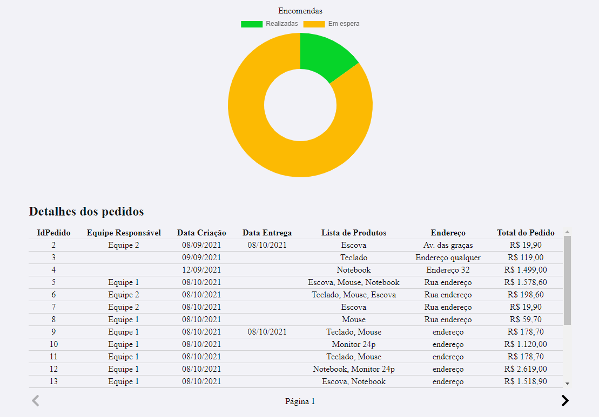

# Resumo
Frontend criado para mostrar o dashboard com informações vindas da API .NET Core.

[A API pode ser encontrada aqui](https://github.com/rafael399/DashboardApi)

Este frontend foi desenvolvido com React e TypeScript. Utilizei as seguintes bibliotecas durante o desenvolvimento:

axios `utilizada para fazer chamadas a API`

react-chartjs-2 `utilizada para mostrar na tela o gráfico de entregas`

react-icons `utilizada para adicionar ícones a aplicação (botões de paginação)`

## Rodando o projeto
Para rodar o projeto, rode os seguintes comandos no diretório do projeto:

`yarn` ou `yarn install` para instalar os pacotes de dependencia

`yarn start` para iniciar a aplicação.

A aplicação será iniciada em `http://localhost:3000/`

